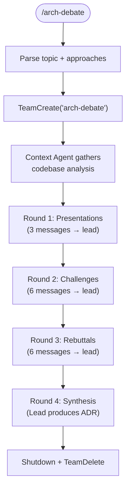

# Architecture Debate

Spawn a structured debate among advocate agents to evaluate competing architectural approaches and produce an Architecture Decision Record (ADR). Three advocates each argue for a different approach, challenge each other's proposals, and the lead synthesizes a well-reasoned decision.

**Lifecycle context:** `docs/SPRINT_LIFECYCLE.md` Phase 4 (optional escalation) | **Patterns:** `skills/team-patterns/SKILL.md`

## Usage

```text
/arch-debate <decision-topic>
/arch-debate <topic> approaches "A,B,C"     # Pre-seed approach names
/arch-debate from-sprint                     # Extract from .sprint/technical.yaml decisions[]
```

## Flow



## Instructions

### 0. Initialize

1. Parse `$ARGUMENTS`:
   - `<topic>` → lead will generate 3 approaches from codebase context
   - `<topic> approaches "A,B,C"` → user-specified approaches, one per advocate
   - `from-sprint` → read `.sprint/technical.yaml` `architecture.decisions[]`, debate each significant decision
2. "Significant" heuristic: new external dependency, affects 5+ files, introduces new pattern, 3+ viable alternatives

### 1. Create Team and Spawn

```
TeamCreate: "arch-debate"
```

| Teammate | Name | Model | Tools | Writes |
|----------|------|-------|-------|--------|
| Context Agent | `ctx` | opus | Read, Grep, Glob, Task | (none) |
| Advocate 1 | `adv-1` | opus | Read, Grep, Glob | (none — messages only) |
| Advocate 2 | `adv-2` | opus | Read, Grep, Glob | (none — messages only) |
| Advocate 3 | `adv-3` | opus | Read, Grep, Glob | (none — messages only) |

Advocates are **read-only** — they analyze and argue, they do not write code. Each advocate's spawn prompt includes the `agents/architect.md` system prompt plus an advocacy overlay:

```
You are a senior software architect acting as an advocate for {approach_name}.
Your job: present {approach_name} with concrete implementation details for THIS
codebase, cite existing patterns, defend with evidence when challenged, and
acknowledge genuine weaknesses honestly — credibility matters more than winning.
```

### 2. Approach Generation

If approaches not user-specified:
1. Context Agent broadcasts codebase analysis
2. Lead generates 3 viable approaches based on: topic, codebase patterns, industry alternatives
3. Lead assigns one approach per advocate via `SendMessage` with structured brief:

```
APPROACH ASSIGNMENT
Topic: {decision topic}
Your Approach: {approach name}
Summary: {2-3 sentences}
Strengths to Develop: {hints}
Known Counterarguments: {hints}
```

### 3. Debate Protocol (4 Rounds)

| Round | Who Acts | Messages | Purpose |
|-------|----------|----------|---------|
| 0 | ctx → broadcast | 1 | Codebase analysis to all advocates |
| 1 | Each advocate → lead | 3 | Present approach with implementation details |
| 2 | Each advocate → lead (2 each) | 6 | Challenge weaknesses in other proposals |
| 3 | Each advocate → lead (2 each) | 6 | Evidence-based defense of own proposal |
| 4 | Lead only | 0 | Synthesize ADR |

**Total: 15 advocate-to-lead messages max.** Lead relay messages (forwarding challenges/rebuttals) are additional.

**Turn order:** Sequential by advocate number within each round (adv-1, adv-2, adv-3). Prevents message ordering issues.

**Challenge routing:** All challenges and rebuttals flow through the lead. The lead forwards relevant content to the targeted advocate. This prevents unstructured cross-talk.

**Round 2 detail:** Lead sends each advocate the OTHER two presentations. Each advocate identifies weaknesses, edge cases, and conflicts in the other proposals.

**Round 3 detail:** Lead sends each advocate the challenges directed at them. Each advocate defends with codebase evidence and industry practice.

### 4. ADR Synthesis (Lead)

Analyze all presentations, challenges, and rebuttals. Write ADR:

```markdown
# ADR-{NNN}: {Decision Title}

## Status
Proposed

## Date
{ISO date}

## Context
{What prompted this decision, constraints, requirements}

## Approaches Considered

### Approach 1: {Name}
**Advocate:** adv-1
**Summary:** {from presentation}
**Strengths:** {from presentation + rebuttal}
**Weaknesses:** {from challenges by others}
**Codebase Evidence:** {specific file references}

### Approach 2: {Name}
{same structure}

### Approach 3: {Name}
{same structure}

## Debate Summary
{Key contentions, areas of agreement, most compelling arguments}

## Decision
{Which approach, why, how challenges were resolved}

## Consequences
### Positive
### Negative
### Trade-offs Accepted
```

**Output files:**
- `.sprint/adr-{NNN}.md` (human-readable ADR)
- If in sprint context: update `.sprint/technical.yaml` `architecture.decisions[].decision` and `rationale`

### 5. Cleanup

1. `SendMessage(type: shutdown_request)` to each teammate
2. `TeamDelete`

## Sprint Integration

The arch-debate is an **optional escalation** during Phase 4 (Technical Planning), not a replacement.

```
Phase 4 produces architecture.decisions[]
  For each decision:
    Routine? → keep as-is
    Significant? → /arch-debate from-sprint
      → ADR overwrites architecture.decisions[] entry
```

In **autonomous mode**: sprint skill auto-detects significant decisions and invokes `/arch-debate from-sprint`.
In **attended mode**: developer is asked whether to debate each decision.

## File Ownership

| Writer | Exclusive Files |
|--------|----------------|
| ctx | (none — read-only) |
| adv-1, adv-2, adv-3 | (none — messages only) |
| lead | `.sprint/adr-{NNN}.md`, `.sprint/technical.yaml` |

## Arguments

```
$ARGUMENTS:
  <topic>                    → Decision topic (lead generates approaches)
  <topic> approaches "A,B,C" → User-specified approaches
  from-sprint                → Debate decisions from .sprint/technical.yaml
```

## Composition

**Invokes (as teammates):** `agents/context-agent.md`, 3 advocate agents (ad-hoc, using `agents/architect.md` methodology)
**Reads:** `.sprint/technical.yaml` (from-sprint mode), codebase patterns
**Writes:** `.sprint/adr-{NNN}.md`, `.sprint/technical.yaml`
**Integrates with:** Phase 4 of `skills/sprint/SKILL.md`
