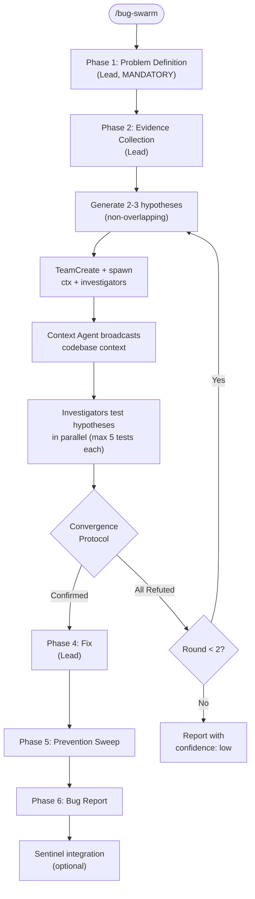

# Bug Swarm

Hypothesis-driven bug investigation using an Agent Team. Follows the 6-phase `skills/bug-investigate/SKILL.md` methodology but parallelizes Phase 3 (Hypothesize & Test) across 2-3 investigators who pursue different hypotheses simultaneously and actively challenge each other's theories.

**Methodology:** `skills/bug-investigate/SKILL.md` | **Patterns:** `skills/team-patterns/SKILL.md` | **Sentinel:** `agents/sentinel.md`

## Usage

```text
/bug-swarm <bug description or error message>
/bug-swarm --hypotheses 3 <bug description>    # Force 3 investigators (default: 2)
```

## Flow



## Instructions

### Phase 1: Problem Definition (Lead, MANDATORY)

Execute Phase 1 of `skills/bug-investigate/SKILL.md` exactly as defined. This is NOT parallelized — the problem must be understood before hypotheses can be generated.

Output: PROBLEM DEFINITION block with observed behavior, expected behavior, reproduction steps.

### Phase 2: Evidence Collection (Lead)

Gather initial evidence following Phase 2 of bug-investigate. Tag each piece with authority level:
- **A:** Reproducer output, stack trace, test failure
- **B:** Logs, git blame, metrics
- **C:** Code reading, pattern analysis
- **D:** Inference, heuristic

Output: EVIDENCE LEDGER

### Hypothesis Generation (Lead)

From the evidence ledger, generate 2-3 competing hypotheses. Each must be:
- **Specific and falsifiable** — clear claim with predicted test outcome
- **Based on distinct evidence subsets** — different root cause theories
- **Non-overlapping** — testing different code paths or mechanisms

### Create Team and Spawn

```
TeamCreate: "bug-swarm"
```

| Teammate | Name | Model | Tools | Writes |
|----------|------|-------|-------|--------|
| Context Agent | `ctx` | opus | Read, Grep, Glob, Task | (none) |
| Investigator A | `inv-a` | opus | Read, Grep, Glob, Bash | `.bugswarm/investigator-a.yaml` |
| Investigator B | `inv-b` | opus | Read, Grep, Glob, Bash | `.bugswarm/investigator-b.yaml` |
| Investigator C | `inv-c` | opus | Read, Grep, Glob, Bash | `.bugswarm/investigator-c.yaml` |

Investigator C is optional (spawned when `--hypotheses 3` or when 3+ mechanisms are plausible).

Each investigator's spawn prompt includes:
- The PROBLEM DEFINITION and EVIDENCE LEDGER
- Their assigned HYPOTHESIS (claim, evidence basis, predicted test outcome)
- Bug-investigate Phase 3 methodology (single-variable tests, max 5 iterations)
- Write boundary and team communication instructions

### Task Creation

```
Task 1: "Gather context for bug investigation scope"
  owner: ctx

Task 2: "Test Hypothesis A: [claim]"
  owner: inv-a
  blockedBy: [Task 1]

Task 3: "Test Hypothesis B: [claim]"
  owner: inv-b
  blockedBy: [Task 1]

Task 4: "Test Hypothesis C: [claim]" (if 3 investigators)
  owner: inv-c
  blockedBy: [Task 1]
```

### Investigator Workflow

Each investigator follows this loop (mirrors bug-investigate Phase 3):

1. Read hypothesis and evidence
2. Design ONE test (single variable)
3. Execute test using Bash (read-only commands: git log, pytest, grep, etc.)
4. Record result: `CONFIRMED` | `REFUTED` | `INCONCLUSIVE`
5. If CONFIRMED → message lead with evidence
6. If REFUTED → attempt secondary hypothesis or message lead
7. If INCONCLUSIVE → message ctx for more info, try another test
8. Maximum 5 test iterations

### Inter-Investigator Communication

Investigators SHOULD message each other:
- `EVIDENCE: Found [evidence] at [location] — may affect your hypothesis`
- `CHALLENGE: Your hypothesis doesn't explain [evidence I found]`
- `COUNTER: [Evidence] contradicts your claim because [reason]`
- `CONCUR: My investigation supports your hypothesis — [evidence]`

### Convergence Protocol

Apply `skills/team-patterns/SKILL.md` Convergence Protocol (Pattern 6):

1. **Early convergence:** One CONFIRMED + peer supporting evidence → done
2. **All refuted:** Return to hypothesis generation. Max 2 rounds, then halt
3. **Conflicting confirmations:** Evidence-quality tiebreaker (A > B > C > D). If tied, test predictions. If still tied, compound bug (both real)
4. **Timeout:** Max iterations exhausted → the strongest partial evidence with `confidence: low`

### Phase 4: Fix (Lead)

Once root cause confirmed:
1. State root cause in one sentence, citing evidence with authority tags
2. Apply minimal fix
3. Verify: re-run reproducer + test suite
4. If fix involves type/lint errors → delegate to `agents/build-error-resolver.md`

### Phase 5: Prevention Sweep (Lead)

Search for the same pattern class elsewhere using `find-patterns` skill or direct Grep. Record matches and remediation status.

### Phase 6: Bug Report (Lead)

Write `.bugswarm/report.yaml`:

```yaml
bug_id: "<descriptive-slug>"
root_cause: "<one sentence>"
confidence: high|medium|low

evidence_chain:
  - tag: A|B|C|D
    description: "<what was found>"
    source: "<investigator + test number>"

fix:
  description: "<what was changed>"
  files_changed: []
  verified_by: []

prevention_sweep:
  pattern: "<what was searched>"
  matches_found: <count>

investigation_summary:
  hypotheses_tested: <count>
  results:
    - hypothesis: A
      claim: "<claim>"
      verdict: CONFIRMED|REFUTED
    - hypothesis: B
      claim: "<claim>"
      verdict: CONFIRMED|REFUTED
  winning_hypothesis: "<letter>"
  collaboration_stats:
    messages_exchanged: <count>
    challenges_issued: <count>

learned: "<reusable insight>"
```

### Sentinel Integration

After the bug report:
1. If the bug represents an emerging issue class → append to `.sentinel/observations.md`
2. If prevention sweep found at-risk patterns → create sentinel entries

## File Ownership

| Writer | Exclusive Files |
|--------|----------------|
| ctx | (none — read-only) |
| inv-a | `.bugswarm/investigator-a.yaml` |
| inv-b | `.bugswarm/investigator-b.yaml` |
| inv-c | `.bugswarm/investigator-c.yaml` (if spawned) |
| lead | `.bugswarm/report.yaml`, `.sentinel/observations.md` (append) |

## Arguments

```
$ARGUMENTS:
  <description>      → Bug description or error message
  --hypotheses N     → Number of investigators (2 or 3, default: 2)
```

## Composition

**Follows:** `skills/bug-investigate/SKILL.md` (6-phase methodology)
**Invokes (as teammates):** `agents/context-agent.md`, investigator agents (ad-hoc, no permanent agent file)
**Integrates with:** `agents/sentinel.md` (emerging issue tracking)
**Delegates to:** `agents/build-error-resolver.md` (if fix involves type/lint errors)
