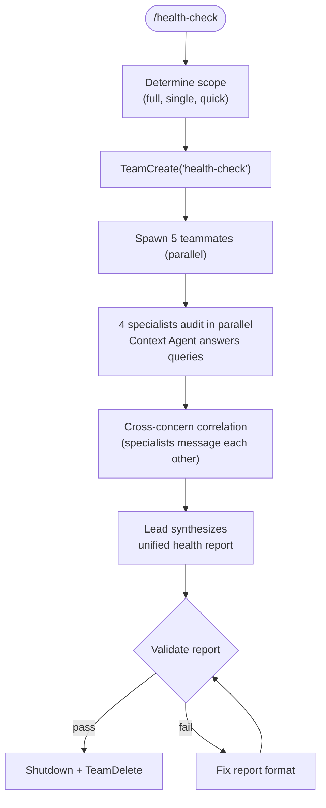

# Health Check

Run a parallel codebase health audit across four dimensions: dependencies, dead code, test coverage, and standards drift. Four specialist teammates audit simultaneously, correlate findings across concerns, and produce a unified health report with prioritized action items.

**Patterns:** `skills/team-patterns/SKILL.md` | **Signals philosophy:** `commands/collect-signals.md` (real data only)

## Usage

```text
/health-check                    # Full audit (all specialists)
/health-check dependencies       # Single dimension only
/health-check quick              # Skip coverage analysis for speed
/health-check integrate          # Run as Phase 12 addon, merge into monitoring-report.yaml
```

## Flow



## Instructions

### 0. Initialize

1. Parse `$ARGUMENTS` for scope (full, single dimension, quick, integrate)
2. Create `.health/` directory if it doesn't exist
3. If previous `.health/health-report.yaml` exists, note timestamp for trend comparison

### 1. Create Team and Spawn

```
TeamCreate: "health-check"
```

| Teammate | Name | Model | Tools | Writes |
|----------|------|-------|-------|--------|
| Context Agent | `ctx` | opus | Read, Grep, Glob, Task | (none) |
| Dependency Auditor | `dep-audit` | sonnet | Read, Bash, Grep, Glob | `.health/dependency-audit.yaml` |
| Dead Code Scanner | `dead-code` | sonnet | Read, Bash, Grep, Glob | `.health/dead-code-audit.yaml` |
| Coverage Analyst | `cov-analyst` | sonnet | Read, Bash, Grep, Glob | `.health/coverage-audit.yaml` |
| Standards Drift Detector | `std-drift` | sonnet | Read, Grep, Glob | `.health/standards-drift-audit.yaml` |

All 5 start immediately in parallel (no sequential dependency on context agent — specialists begin auditing while context gathers).

### 2. Specialist Workflows

**Dependency Auditor:**
1. Run `pip-audit` (or `safety check` as fallback) — extract vulnerabilities by severity
2. Run `pipdeptree` — find unused/orphan dependencies
3. Check `requirements.txt` / `pyproject.toml` for version pinning practices
4. Write `.health/dependency-audit.yaml`

**Dead Code Scanner:**
1. Run `vulture . --min-confidence 80` — find unused code
2. Run `ruff check . --select F401,F841` — unused imports and variables
3. Filter false positives: Flask routes, Celery tasks, signal handlers, CLI commands, SQLAlchemy models (per `agents/refactor-cleaner.md` safety rules)
4. Write `.health/dead-code-audit.yaml`

**Coverage Analyst:**
1. Run `pytest --cov --cov-report=term-missing -q`
2. Parse per-module coverage percentages
3. Identify critical paths with low coverage (prioritize by module importance)
4. Compare against previous report if available
5. Write `.health/coverage-audit.yaml`
- Skipped in `quick` mode

**Standards Drift Detector:**
1. Read `.claude/project-standards.yaml` via `standards-lookup` skill
2. For each standard, scan codebase for violations
3. Distinguish "pre-adoption drift" (git blame date < standard adoption date) from "post-adoption violation"
4. Write `.health/standards-drift-audit.yaml`

### 3. Cross-Concern Correlation

Specialists message each other during audits to correlate findings:
- `dead-code` → `cov-analyst`: "Module X has 12 unused functions — what's the coverage?"
- `cov-analyst` → `dead-code`: "0% coverage on module X — flag as dead module candidate"
- `dep-audit` → `cov-analyst`: "Package Y has known CVE — are affected code paths tested?"
- `std-drift` → `ctx`: "When was the type annotations standard adopted? Need date for drift classification"

Each specialist report includes a `correlations:` section for cross-references discovered.

### 4. Lead Synthesis

Read all four `.health/*.yaml` specialist reports. Produce `.health/health-report.yaml`:

1. Deduplicate: same file flagged by multiple specialists → merge into single finding
2. Score each finding: `priority_score = severity_weight * impact_weight / effort_weight`
   - Severity: critical=4, high=3, medium=2, low=1
   - Impact: high=3, medium=2, low=1
   - Effort: XS=1, S=2, M=3, L=4, XL=5
3. Sort action items by priority_score (highest first)
4. Determine `overall_health`: healthy | warning | degraded
5. If previous report exists, compute `trends.direction`: improving | stable | declining

### 5. Phase 12 Integration

If `integrate` mode:
1. Read existing `.sprint/monitoring-report.yaml`
2. Append `codebase_health` section with overall status, summary, report path, critical finding count
3. Merge top action items into `monitoring-report.yaml.actionable_items[]`

### 6. Sentinel Deduplication

If `.sentinel/report.md` exists:
- Read sentinel findings
- Skip health check findings already captured by sentinel
- Note patterns: "Sentinel caught dead code in 4 of last 5 sprints — consider cleanup sprint"

### 7. Cleanup

1. `SendMessage(type: shutdown_request)` to each teammate
2. `TeamDelete`

## Health Report Schema

```yaml
# .health/health-report.yaml
audit_timestamp: "<ISO>"
audit_scope: full|dependencies|quick
overall_health: healthy|warning|degraded

dimensions:
  dependencies:
    status: healthy|warning|degraded
    vulnerabilities: {critical: 0, high: 0, medium: 0, low: 0}
    outdated: <count>
    unused: <count>
  dead_code:
    status: healthy|warning|degraded
    unused_functions: <count>
    unused_imports: <count>
    dead_modules: <count>
  coverage:
    status: healthy|warning|degraded
    overall_percentage: <number>
    critical_gaps: <count>
  standards_drift:
    status: healthy|warning|degraded
    post_adoption_violations: <count>
    pre_adoption_drift: <count>

action_items:
  - id: HEALTH-001
    severity: critical|high|medium|low
    effort: XS|S|M|L|XL
    impact: high|medium|low
    priority_score: <computed>
    dimension: dependencies|dead_code|coverage|standards_drift
    title: "<short actionable title>"
    description: "<what to do>"

correlations:
  - finding: "<cross-dimension observation>"
    dimensions: [dead_code, coverage]
    combined_action: "<what to do>"

trends:
  previous_audit: "<timestamp>"|null
  direction: improving|stable|declining|unknown
```

## File Ownership

| Writer | Exclusive Files |
|--------|----------------|
| ctx | (none — read-only) |
| dep-audit | `.health/dependency-audit.yaml` |
| dead-code | `.health/dead-code-audit.yaml` |
| cov-analyst | `.health/coverage-audit.yaml` |
| std-drift | `.health/standards-drift-audit.yaml` |
| lead | `.health/health-report.yaml` |

## Cadence

| Trigger | Scope |
|---------|-------|
| Phase 12 (post-merge) | `quick` |
| Weekly | `full` |
| Pre-release | `full` |
| Post-refactor | `full` |

## Arguments

```
$ARGUMENTS:
  (none)          → Full audit
  dependencies    → Dependency dimension only
  quick           → Skip coverage analysis
  integrate       → Merge into monitoring-report.yaml
```

## Composition

**Invokes (as teammates):** `agents/context-agent.md`, 4 specialist agents (ad-hoc, no permanent agent files)
**Leverages:** `agents/refactor-cleaner.md` safety rules (false-positive filtering), `skills/compliance-check/SKILL.md`, `skills/standards-lookup/SKILL.md`
**Integrates with:** `commands/collect-signals.md` (Phase 12), `agents/sentinel.md` (deduplication)
**State:** `.health/` directory (persists across sprints for trend tracking)
