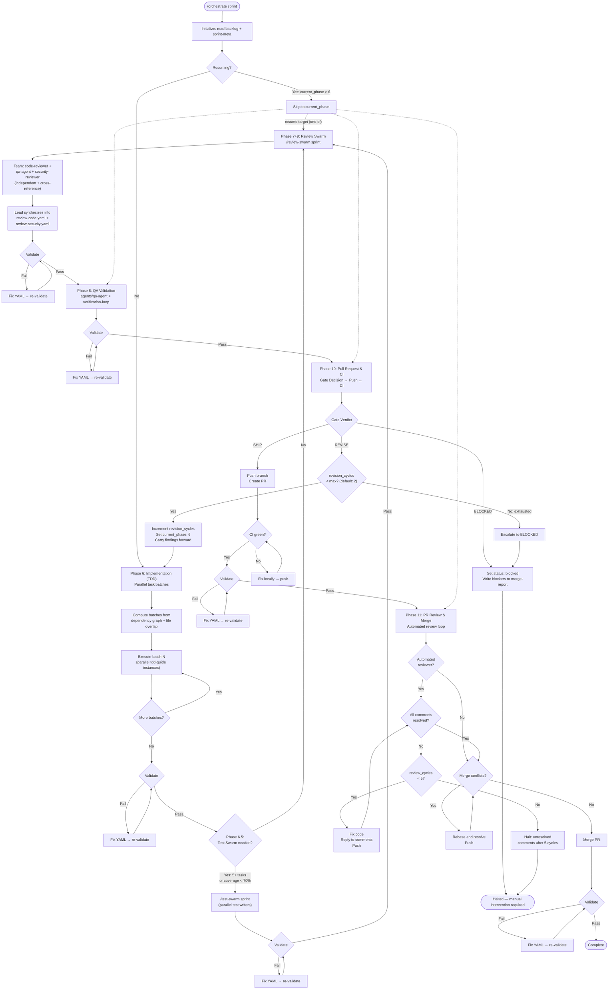

# Orchestrate Command

Execute Phases 6-11 of the sprint lifecycle: implementation through merge. Sequences agents, writes validated handoff files, and manages the revision cycle.

**Lifecycle context:** `docs/SPRINT_LIFECYCLE.md` | **Templates:** `skills/sprint/templates/` | **Validation:** `python3 -m scripts.sprint.validate .sprint/`

## Usage

```text
/orchestrate sprint
```

## Flow



## Junction Mode

- `/orchestrate sprint` — **Continuous mode.** Runs Phases 6-11 sequentially as a pipeline. Each phase chains into the next automatically. Use this when the full execution pipeline is desired (typically called by `/sprint-run`).
- `/orchestrate phase <N>` — **Single mode.** Runs one phase (6, 7, 8, 10, or 11) and returns control. Each phase is independent — no downstream cascade. Use this to invoke individual execution phases in non-sprint workflows.

## Instructions

You are executing sprint execution phases. In continuous mode (`/orchestrate sprint`), follow each phase in order. In single mode (`/orchestrate phase <N>`), run only the requested phase. Do not advance until each phase's output passes validation.

### 0. Initialize

1. Read `.sprint/backlog.yaml`. If it does not exist, halt: "No backlog found. Run sprint planning (Phases 1-5) first."

2. Read `.sprint/sprint-meta.yaml` and check `current_phase` and `status`:
   - `status: blocked` or `failed` → halt: "Sprint is blocked/failed. Resolve before continuing."
   - `current_phase` > 6 and `status: in_progress` → **resume** from that phase (skip earlier phases)
   - `revision_cycles` > 0 → this is a revision cycle. Read prior review outputs (Phases 7-9) for findings to address.

3. Set `current_phase: 6` and `status: in_progress` in sprint-meta.yaml (unless resuming from a later phase).

### Phase 6: Implementation (TDD) — Parallel Task Batches

**Agent:** `agents/tdd-guide.md` | **Output:** `.sprint/execution-status.yaml` + `.sprint/execution-log.md`

1. Read tasks from `.sprint/backlog.yaml`.
2. If this is a **revision cycle**, build a revision brief first (see [Revision Brief](#revision-brief)).
3. **Compute parallel batches:**
   a. Build a dependency graph from each task's `dependencies.blocked_by`.
   b. Group tasks into batch levels: a task enters the earliest level where all its `blocked_by` tasks are in prior levels.
   c. Within each level, check for file-write overlap using each task's `files.write`. If two tasks in the same level share a write file, move the later one to a sub-level.
   d. The result is an ordered list of batches. Tasks within each batch can run in parallel.

   Example (from the backlog template):
   ```
   Batch 1: [TASK-001]                   — no deps
   Batch 2: [TASK-002, TASK-003]         — both blocked_by TASK-001, no file overlap
   Batch 3: [TASK-004]                   — blocked_by TASK-002 + TASK-003
   Batch 4: [TASK-005]                   — blocked_by TASK-004
   Batch 5: [TASK-006]                   — blocked_by TASK-004 + TASK-005
   Batch 6: [TASK-007]                   — blocked_by TASK-006
   ```

4. **Execute each batch:**
   a. For each batch, invoke multiple `tdd-guide` agents simultaneously using parallel Task calls (one Task call per task in the batch, all in a single message).
   b. Each Task call includes:
      - Task ID, title, and acceptance criteria from the backlog
      - Architecture and file change plan from `.sprint/technical.yaml`
      - Write boundary: the list of files this instance may write (from `files.write`)
      - If revision cycle: the task's relevant findings from the revision brief
   c. Wait for all tasks in the batch to complete before starting the next batch.
   d. If a task fails, record it as `status: failed`. Skip downstream tasks whose `blocked_by` includes the failed task — record them as `status: skipped`.

5. Aggregate results from all batches into `.sprint/execution-status.yaml` and `.sprint/execution-log.md`:
   - `tasks_completed[]` — per-task status, test counts, files changed
   - `execution_stats` — aggregate counts
   - `signals.pass` — true only if all tasks completed
6. Validate: `python3 -m scripts.sprint.validate .sprint/`
7. Update sprint-meta.yaml: `current_phase: 7`, append to `phase_log`.

**Fallback:** If the backlog lacks `files.write` or `dependencies` data, fall back to sequential execution (one task at a time in `task_order`).

### Phase 6.5: Test Swarm (Optional)

**Command:** `commands/test-swarm.md` | **Output:** `.sprint/test-swarm-report.yaml`

This phase is **conditional**. Invoke `/test-swarm sprint` when any of:
- Sprint backlog has 5+ tasks (major feature)
- Sprint involves 3+ modules (cross-cutting changes)
- Coverage after Phase 6 is below 70% (run `pytest --cov -q` to check)
- Developer explicitly requests it

If none apply, skip to Phase 7.

The test swarm spawns parallel test writers (unit, integration, e2e) with a coverage monitor that creates gap tasks. See `commands/test-swarm.md` for full details.

1. Invoke `/test-swarm sprint`
2. Validate `.sprint/test-swarm-report.yaml`: `python3 -m scripts.sprint.validate .sprint/`
3. Update sprint-meta.yaml: append to `phase_log`.

### Phase 7+9: Review Swarm — Collaborative Review Team

**Command:** `commands/review-swarm.md` | **Output:** `.sprint/review-code.yaml` + `.sprint/review-security.yaml`

This phase replaces the previous separate Phase 7 (code review) and Phase 9 (security review) with a single Review Swarm that runs all three review dimensions concurrently using an Agent Team.

1. Invoke `/review-swarm sprint`
   - The swarm spawns: Context Agent + code-reviewer + qa-agent + security-reviewer as teammates
   - All three reviewers work independently, each writing to their own file in `.sprint/swarm/`
   - Reviewers can challenge each other's findings, escalate issues, and cross-reference
   - The lead synthesizes into `.sprint/review-code.yaml` and `.sprint/review-security.yaml`
2. Validate both output files: `python3 -m scripts.sprint.validate .sprint/`
3. Update sprint-meta.yaml: `current_phase: 8`, append to `phase_log`.

The gate-decision skill (Phase 10) reads the same files — no downstream changes needed.

> **Note:** The phase_log will record phases 7, 9, then 8 because QA (Phase 8) runs after the combined review-swarm (Phases 7+9). This is intentional — the canonical phase numbers are preserved for template compatibility.

### Phase 8: QA Validation

**Agents:** `agents/qa-agent.md` + `skills/verification-loop/` + `agents/e2e-runner.md` | **Output:** `.sprint/qa-report.yaml`

1. Invoke `qa-agent` to verify each acceptance criterion from the backlog.
2. Run the verification loop (`skills/verification-loop/`):
   - Type check: `mypy .`
   - Lint: `ruff check .`
   - Format: `ruff format --check .`
   - Tests: `pytest -v`
   - Coverage: `pytest --cov --cov-report=term`
3. If end-to-end tests apply, invoke `e2e-runner`.
4. If `.sprint/test-swarm-report.yaml` exists (Phase 6.5 ran), incorporate its coverage data into the QA report.
5. Write `.sprint/qa-report.yaml` following `skills/sprint/templates/qa-report.yaml`. Key fields:
   - `test_results` — total, passing, failing, skipped, errors
   - `coverage` — percentage, delta, uncovered files
   - `acceptance_criteria[]` — per-criterion pass/fail with evidence
   - `qa_summary` — aggregate for the gate decision
6. Validate, then update sprint-meta.yaml: `current_phase: 10`, append to `phase_log`.

### Phase 10: Pull Request & CI

**Skill:** `skills/gate-decision/SKILL.md` | **Command:** `commands/push.md` | **Output:** `.sprint/ci-report.yaml`

This phase gates code quality, creates the pull request, and verifies CI passes on GitHub.

1. Apply the gate-decision skill. It reads Phases 7-9 outputs and produces a verdict: **SHIP**, **REVISE**, or **BLOCKED**.
   - In **attended mode** (`velocity_mode: attended` in sprint-meta.yaml), the gate-decision skill presents the verdict to the developer and offers override options. See `skills/gate-decision/SKILL.md`.
2. Act on the verdict:

#### SHIP — Create Pull Request

1. Invoke `commands/push.md` — stage, commit, push branch to remote, create PR against target branch.
2. Wait for the CI pipeline to run on GitHub (GitHub Actions, triggered by the PR).
3. Check CI status via `gh pr checks <pr_number> --watch`.
4. If CI fails:
   - Read the failing check logs: `gh run view <run_id> --log-failed`
   - Fix the issues locally.
   - Push the fixes. CI re-runs automatically.
   - Repeat until CI is green (maximum 5 attempts — if CI still fails, halt with `status: blocked`).
5. Write `.sprint/ci-report.yaml` following `skills/sprint/templates/ci-report.yaml`. Key fields:
   - `pipeline` — `build_status`, `lint_clean`, `type_check_clean`, `duration_seconds`
   - `steps[]` — per-step status and details
   - `pr` — `number`, `url`, `branch`
   - `gate_decision` — verdict and rationale from the gate-decision skill
6. Validate, then update sprint-meta.yaml: `current_phase: 11`, append to `phase_log`.

#### REVISE — Loop Back

1. Read `revision_cycles` from sprint-meta.yaml.
2. If `revision_cycles` >= `max_revision_cycles` (default: 2) → **escalate to BLOCKED** (3 total attempts is the maximum). Write `.sprint/merge-report.yaml` with `verdict: BLOCKED` and accumulated findings from all attempts. Set `status: blocked`. Halt.
3. Otherwise, iterate:
   - Increment `revision_cycles` in sprint-meta.yaml.
   - Set `current_phase: 6` in sprint-meta.yaml.
   - Return to Phase 6. Prior review outputs (Phases 7-9) remain on disk as context. Each phase overwrites its output file on the next pass.

#### BLOCKED — Halt

1. Set `status: blocked` and `last_error` in sprint-meta.yaml.
2. Write `.sprint/merge-report.yaml` with `verdict: BLOCKED`, all blockers, and suggested intervention steps.
3. Halt. Manual intervention required.

### Phase 11: PR Review & Merge

**Tools:** `gh` CLI | **Output:** `.sprint/merge-report.yaml`

This phase runs the automated PR review loop and merges the pull request. CodeRabbit reviews the PR on GitHub after it is created — this is distinct from Phase 7's local code review, which uses `code-reviewer` and `qa-agent` agents before the PR exists.

1. **Check for automated reviewer.** If no automated PR reviewer (e.g., CodeRabbit) is configured on the repository, skip to step 6 (merge conflicts).

2. **Wait for review.** The automated reviewer is triggered when the PR is created or updated. Wait for its review to appear.

3. **Read review comments.** Use `gh api repos/{owner}/{repo}/pulls/{pr_number}/comments` to list all review comments. Parse each comment for:
   - File path and line number
   - The requested change or concern
   - Resolution status (pending, resolved, outdated)

4. **Address each unresolved comment:**
   - Fix the code based on the reviewer's feedback.
   - Reply to the comment explaining the fix: `gh api repos/{owner}/{repo}/pulls/comments/{comment_id}/replies -f body="<explanation>"`.

5. **Push fixes and check resolution.** Stage and push all changes. This triggers a new review cycle. Re-read PR comments. If unresolved comments remain, repeat steps 3-5. Maximum **5 review cycles** — if comments remain unresolved after 5 cycles, halt with `status: blocked` and list the unresolved comments in merge-report.yaml for manual intervention.

6. **Resolve merge conflicts.** If the target branch has diverged:
   - Rebase the feature branch onto the target: `git fetch origin && git rebase origin/<target_branch>`
   - Resolve any conflicts intelligently (prefer feature branch changes for new code, preserve target branch changes for unrelated areas).
   - Push the rebased branch: `git push --force-with-lease`

7. **Merge the pull request.** Once all comments are resolved and CI is green:
   - `gh pr merge <pr_number> --squash --delete-branch`
   - Default merge strategy is squash. To use a different strategy, set `merge_strategy` in `.sprint/config.yaml` (options: `squash`, `merge`, `rebase`).

8. **Write `.sprint/merge-report.yaml`** following `skills/sprint/templates/merge-report.yaml`. Key fields:
   - `gate_decision` — verdict and signal summary (carried from Phase 10)
   - `merge` — `pr_number`, `pr_url`, `merge_commit`, `target_branch`, `merged_at`
   - `pr_review` — `review_cycles`, `comments_total`, `comments_resolved`, `reviewer`
9. Validate, then update sprint-meta.yaml: `status: complete`, append final `phase_log` entry.
10. Done. Sprint Runner proceeds to Phase 12.

## Revision Brief

On a revision cycle (`revision_cycles` > 0), the tdd-guide agent needs to know what to fix. Build a revision brief before starting Phase 6:

1. Read the prior review outputs that are still on disk (if a review file does not exist, e.g. review-swarm not yet run, treat it as having no findings for that phase):
   - `.sprint/review-code.yaml` → extract findings where `status: open`
   - `.sprint/qa-report.yaml` → extract failing tests and unmet acceptance criteria
   - `.sprint/review-security.yaml` → extract findings where `status: open` or `status: resolved` with severity > none
2. Group findings by file path.
3. Map files to tasks using `tasks_completed[].files_changed` from `.sprint/execution-status.yaml`.
4. For each task, attach its relevant findings when invoking the tdd-guide agent. The agent must address each finding.
5. Findings that don't map to a specific task (e.g., lint failures, global coverage gaps) are passed as general context to all task invocations.

## After Each Phase

Update `.sprint/sprint-meta.yaml`:

```yaml
current_phase: <next phase number>
phase_log:
  - phase: <completed phase>
    phase_name: <name>
    status: complete  # or failed | blocked
    started_at: "<ISO timestamp>"
    completed_at: "<ISO timestamp>"
    output_file: <filename>
    validated: true
```

If a phase fails, set `status: failed`, record `last_error`, and halt.

**Pause sentinel (continuous mode only):** After updating sprint-meta.yaml and before starting the next phase, check if `.sprint/pause` exists. If it does, halt with: "Sprint paused at Phase {N}. Remove `.sprint/pause` and run `/sprint-run resume` to continue." This allows external control over the pipeline without aborting it.

## Error Handling

### Validation Failure

1. Read the error — it identifies the schema violation (missing field, wrong type).
2. Fix the output YAML to match the template in `skills/sprint/templates/`.
3. Re-validate: `python3 -m scripts.sprint.validate .sprint/`
4. Do not advance until validation passes.

### Agent Failure

If an agent times out or produces no output:

1. Retry the phase once.
2. If retry fails, set `status: failed` in phase_log and `last_error` in sprint-meta.yaml.
3. Write merge-report.yaml with `verdict: BLOCKED` explaining which phase failed.
4. Halt.

### Revision Cycle Exhaustion

After 3 total attempts (initial + 2 revision cycles):

1. Set `status: blocked` in sprint-meta.yaml.
2. Write merge-report.yaml with `verdict: BLOCKED` and accumulated findings from all attempts.
3. List the unresolved issues that persisted across iterations.
4. Suggest manual intervention steps based on the findings.

## Parallel Execution

The orchestrate command uses parallel Task tool calls where agents are independent. This follows the fan-out/fan-in pattern from `.dev/multi-agent/patterns.md`.

**What runs in parallel:**

| Phase | Parallel Unit | Condition |
|-------|--------------|-----------|
| 6 | Task batches (multiple tdd-guide instances) | Tasks with no dependency conflicts and no file-write overlap |
| 6.5 | Test Swarm (unit + integration + e2e writers) | Optional — when 5+ tasks, 3+ modules, or coverage < 70% |
| 7+9 | Review Swarm (code-reviewer + qa-agent + security-reviewer) | Always — Agent Team with cross-reference window |

**What runs sequentially:**

| Phase | Reason |
|-------|--------|
| 8 (QA) | Runs verification commands (mypy, ruff, pytest) that check all code globally |
| 10 (Gate + PR) | Decision gate — must complete before any push |
| 11 (PR Review + Merge) | Polling loop — inherently sequential |

**Constraints:**
- **Single-writer ownership:** Each parallel tdd-guide instance gets exclusive write access to its task's `files.write` list. No two agents in the same batch may write to the same file. The batch algorithm enforces this.
- **Batch boundaries:** The next batch starts only when all tasks in the current batch have completed.
- **Result aggregation:** The orchestrator (not the agents) writes all `.sprint/*.yaml` handoff files. Agents produce results via Task return; the orchestrator assembles them.

## Arguments

$ARGUMENTS:
- `sprint` — Execute Phases 6-11 as a continuous pipeline (junction mode: continuous)
- `phase <N>` — Execute a single phase N (6, 7, 8, 10, 11) and return control (junction mode: single)

## Single Phase Execution

When invoked via `/orchestrate phase <N>`, run only the specified phase and return control.

### Argument Validation

```text
Parse N from "phase <N>".
Valid values: 6, 6.5, 7, 8, 10, 11
If N is not valid:
  If N is 1-5: "Phase {N} is a planning phase. Use /sprint phase {N} instead."
  If N is 9: "Phase 9 runs as part of Phase 7 (review swarm). Use /orchestrate phase 7."
  If N is 12-13: "Phase {N} is post-merge. Use /sprint-run for the full lifecycle."
  Otherwise: "Invalid phase number: {N}. Valid execution phases: 6, 6.5, 7, 8, 10, 11."

Note: Phase 6.5 = test swarm (optional, normally conditional in pipeline mode)
      Phase 7 = combined review swarm (Phases 7+9 together)
```

### Prerequisite Check

```text
Phase prerequisites (hard = required, soft = used if available):
  6    → hard: .sprint/backlog.yaml (status: complete)
  6.5  → hard: .sprint/execution-status.yaml (status: complete)
  7    → hard: .sprint/execution-status.yaml (status: complete)
  8    → hard: .sprint/execution-status.yaml (status: complete)
         soft: .sprint/review-code.yaml, .sprint/review-security.yaml
  10   → hard: .sprint/qa-report.yaml (status: complete)
         soft: .sprint/review-code.yaml, .sprint/review-security.yaml
  11   → hard: .sprint/ci-report.yaml (status: complete, with PR number)

Read the hard prerequisite file.
If file does not exist:
  Halt: "Phase {N} requires {prerequisite_file}.
    File not found. Run the prerequisite phase first."
If file exists but status != "complete":
  Halt: "Prerequisite phase is not complete (status: {status}).
    Complete it before running Phase {N}."

For soft prerequisites:
  If file exists: read and include as context.
  If file does not exist: proceed without it, note "not available" in output.
```

### Soft Prerequisites (Single Phase Mode Only)

In single-phase mode (`/orchestrate phase <N>`), soft prerequisites from the table above are optional — if absent, the phase proceeds without that context and notes "not available" in its output. Specifically:

- **Phase 8 standalone:** Runs verification checks (mypy, ruff, pytest, coverage) without review context if review files are absent.
- **Phase 10 standalone:** Gate decision operates on QA data alone if reviews were not run, but flags "reviews not available" as a risk factor in the verdict.

In continuous mode (`/orchestrate sprint`), all prerequisites are hard because phases run in sequence and all outputs are guaranteed to exist.

### sprint-meta.yaml Handling

```text
If .sprint/sprint-meta.yaml does not exist (standalone invocation):
  Create a minimal sprint-meta.yaml:
    sprint_id: <short uuid>
    _schema_version: "1.0"
    started: <ISO timestamp>
    velocity_mode: autonomous
    requirements: "(standalone phase invocation)"
    current_phase: N
    status: in_progress
    phase_log: []

If sprint-meta.yaml exists:
  Update current_phase to N and status to in_progress.
```

### Execute and Return

Run only the instructions for Phase N as specified in the existing phase sections above. After the phase completes:

```text
1. Write phase output file
2. Validate: python3 -m scripts.sprint.validate .sprint/
3. Update sprint-meta.yaml: current_phase = next phase number
4. Display: "✓ Phase {N}: {phase_name} complete → .sprint/{filename}
   Ready for Phase {next}. Run /orchestrate phase {next} to continue."
5. STOP. Do not proceed to the next phase. Return control to the caller.
```

## Composition

**Invokes:**
- `agents/tdd-guide.md` — Phase 6: implementation (parallel batches per dependency graph)
- `commands/test-swarm.md` — Phase 6.5: parallel test writing (optional, Agent Team)
- `commands/review-swarm.md` — Phase 7+9: collaborative code + security review (Agent Team)
- `agents/qa-agent.md` — Phase 8: acceptance verification
- `agents/e2e-runner.md` — Phase 8: end-to-end tests (if applicable)
- `skills/verification-loop/` — Phase 8: type check, lint, format, tests, coverage
- `skills/gate-decision/` — Phase 10: SHIP / REVISE / BLOCKED verdict (reads Phases 7-9 outputs)
- `commands/push.md` — Phase 10: push branch, create PR (SHIP only)
- `gh` CLI — Phase 11: PR review comments, merge

**Reads:**
- `.sprint/backlog.yaml` — ordered task list (Phase 5)
- `.sprint/technical.yaml` — architecture and file change plan (Phase 4)
- `.sprint/sprint-meta.yaml` — current phase, revision cycles, velocity mode

**Writes:**
- `.sprint/execution-log.md` — Phase 6 (markdown, no envelope)
- `.sprint/execution-status.yaml` — Phase 6
- `.sprint/test-swarm-report.yaml` — Phase 6.5 (optional)
- `.sprint/review-code.yaml` — Phase 7+9 (via review-swarm)
- `.sprint/review-security.yaml` — Phase 7+9 (via review-swarm)
- `.sprint/qa-report.yaml` — Phase 8
- `.sprint/ci-report.yaml` — Phase 10
- `.sprint/merge-report.yaml` — Phase 11
- `.sprint/sprint-meta.yaml` — updated after each phase

## Used By

Called by `commands/sprint-run.md` after Phase 5 completes.
