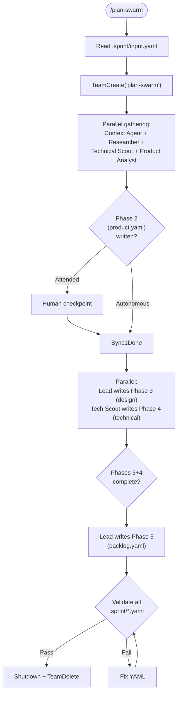

# Plan Swarm

Parallelize sprint planning (Phases 2-5) using a specialist team. After Phase 1 (human intake), specialists fan out to gather data simultaneously, then converge to produce the standard handoff files. Enhancement to the sequential `skills/sprint/SKILL.md`, not a replacement.

**Lifecycle context:** `docs/SPRINT_LIFECYCLE.md` Phases 2-5 | **Patterns:** `skills/team-patterns/SKILL.md`

## Usage

```text
/plan-swarm                      # Run Phases 2-5 in parallel team mode (autonomous)
/plan-swarm attended             # Run with human checkpoints at each phase
/plan-swarm status               # Show team progress
```

## Prerequisites

- `.sprint/input.yaml` must exist (Phase 1 complete)
- `.sprint/sprint-meta.yaml` must exist with `current_phase >= 1` (ready for planning)

## Flow



## Instructions

### 0. Initialize

1. Read `.sprint/input.yaml` (Phase 1 output — the intake)
2. Read `.sprint/sprint-meta.yaml` for `velocity_mode` (autonomous | attended)
3. Create `.sprint/.planning/` directory for intermediate working files
4. Check for previous sprint artifacts: `.sprint/retrospective.yaml`, `feedback-intake.yaml`, `monitoring-report.yaml`

### 1. Create Team and Spawn

```
TeamCreate: "plan-swarm"
```

| Teammate | Name | Model | Tools | Writes |
|----------|------|-------|-------|--------|
| Context Agent | `ctx` | opus | Read, Grep, Glob, Task | `.sprint/.planning/context-brief.yaml` |
| Researcher | `researcher` | opus | Read, Grep, Glob | `.sprint/.planning/research-brief.yaml` |
| Technical Scout | `tech-scout` | opus | Read, Grep, Glob, Bash | `.sprint/.planning/technical-brief.yaml`, `.sprint/technical.yaml` |
| Product Analyst | `prod-analyst` | opus | Read, Grep, Glob | `.sprint/product.yaml` |

Lead (command executor) writes: `.sprint/design.yaml`, `.sprint/backlog.yaml`, `.sprint/sprint-meta.yaml`

### 2. Parallel Gathering Phase (ALL START SIMULTANEOUSLY)

All 4 teammates receive `.sprint/input.yaml` content in their spawn prompts and begin immediately:

**Context Agent:**
- Gather codebase state, standards, existing patterns via standard workflow
- Broadcast briefing to all teammates
- Remain available for CONTEXT_REQUEST messages

**Researcher:**
- Read previous sprint artifacts (if they exist):
  - `.sprint/retrospective.yaml` — what worked, what didn't, estimation bias
  - `.sprint/feedback-intake.yaml` — carried-forward feedback items
  - `.sprint/monitoring-report.yaml` — signal trends
- Produce `.sprint/.planning/research-brief.yaml` with:
  - Carried-forward items (deferred tasks, unresolved feedback)
  - Retrospective highlights
  - Monitoring signal trends
- Message `prod-analyst`: "Previous sprint deferred stories US-X, US-Y — consider carrying forward"

**Technical Scout:**
- Explore codebase for patterns, dependencies, risks related to intake
- Assess technical feasibility and complexity
- Produce `.sprint/.planning/technical-brief.yaml` with:
  - Related files and existing patterns
  - Dependency analysis (internal + external)
  - Risk assessment with likelihood/impact/mitigation
  - Architecture notes
- Message `prod-analyst`: "Module X uses {pattern} — feasibility note for user stories touching X"

**Product Analyst:**
- Refine user stories from `input.yaml`
- Define acceptance criteria (specific, testable)
- Set scope boundaries (must-have vs should-have vs won't-do)
- Incorporate messages from Researcher (deferred stories) and Technical Scout (feasibility)
- Write `.sprint/product.yaml` (Phase 2 output) with standard handoff envelope

### 3. Sync Point: Phase 2 Complete

Wait for Product Analyst to write `.sprint/product.yaml`.

If **attended mode**: present Phase 2 summary to human via `AskUserQuestion`:
- Options: [Continue] [Edit] [Restart Phase]
- If Edit/Restart: message `prod-analyst` with feedback, await revision
- Team remains alive during checkpoint

### 4. Parallel Phase 3 + Phase 4

After Phase 2 is approved, two outputs can be produced in parallel:

**Lead writes `.sprint/design.yaml` (Phase 3):**
- Read `product.yaml` + Context Agent briefing + Researcher brief
- Produce design specification: UI/UX flows or API contract, component breakdown, data model changes

**Technical Scout writes `.sprint/technical.yaml` (Phase 4):**
- Read `product.yaml` + own codebase exploration + Context Agent briefing
- Produce technical specification: architecture decisions, file change map, risks, test strategy

If **attended mode**: present Phase 3 and Phase 4 summaries separately for approval. In attended mode, Phases 3 and 4 wait for Phase 2 approval before writing final outputs (gathering still happens in parallel).

### 5. Phase 5: Backlog (Lead, Sequential)

After Phases 3 and 4 complete:

Lead reads all prior outputs and writes `.sprint/backlog.yaml`:
- Ordered task list with estimates and dependencies
- Dependency graph for parallel batch computation
- Files changed per task (for write-ownership enforcement)
- Acceptance criteria mapping (task → user story)

If **attended mode**: present backlog for approval.

### 6. Validate and Cleanup

1. `python3 -m scripts.sprint.validate .sprint/`
2. Update `.sprint/sprint-meta.yaml`: `current_phase: 6`, log Phases 2-5 complete
3. `SendMessage(type: shutdown_request)` to each teammate
4. `TeamDelete`
5. Clean up `.sprint/.planning/` (intermediate files no longer needed)

## Sprint Runner Integration

In `commands/sprint-run.md`, add team_mode conditional:

```
Phase 1: invoke /sprint (intake stage only)

If team_mode enabled:
  Phases 2-5: invoke /plan-swarm
Else:
  Phases 2-5: invoke /sprint (sequential, unchanged)
```

Activation: `team_mode: true` in `.sprint/sprint-meta.yaml`.

## File Ownership

| Writer | Exclusive Files |
|--------|----------------|
| ctx | `.sprint/.planning/context-brief.yaml` |
| researcher | `.sprint/.planning/research-brief.yaml` |
| tech-scout | `.sprint/.planning/technical-brief.yaml`, `.sprint/technical.yaml` |
| prod-analyst | `.sprint/product.yaml` |
| lead | `.sprint/design.yaml`, `.sprint/backlog.yaml`, `.sprint/sprint-meta.yaml` |

## Arguments

```
$ARGUMENTS:
  (none)    → Autonomous mode (default)
  attended  → Human checkpoints at each phase
  status    → Show team progress
```

## Composition

**Invokes (as teammates):** `agents/context-agent.md`, researcher (ad-hoc), technical scout (ad-hoc, uses `agents/architect.md` + `agents/planner.md` methodology), product analyst (ad-hoc)
**Reads:** `.sprint/input.yaml`, previous sprint artifacts
**Writes:** `.sprint/product.yaml`, `.sprint/design.yaml`, `.sprint/technical.yaml`, `.sprint/backlog.yaml`
**Used by:** `commands/sprint-run.md` (when `team_mode` enabled)
**Produces identical outputs** to sequential `skills/sprint/SKILL.md` — downstream phases see no difference
