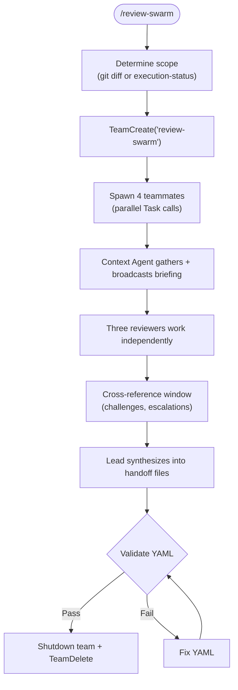

# Review Swarm

Multi-perspective code review using an Agent Team. Three reviewers (code quality, QA compliance, security) work as independent teammates who CAN collaborate — challenge findings, cross-reference issues, debate severity. Replaces separate Phase 7 + Phase 9 with a single concurrent pass.

**Lifecycle context:** `docs/SPRINT_LIFECYCLE.md` Phases 7+9 | **Templates:** `skills/sprint/templates/` | **Patterns:** `skills/team-patterns/SKILL.md`

## Usage

```text
/review-swarm                    # Standalone: review uncommitted changes
/review-swarm sprint             # Integrated: called by orchestrate for Phases 7+9
```

## Flow



## Instructions

### 0. Initialize

1. Parse `$ARGUMENTS`:
   - No args → standalone mode. Scope: `git diff --name-only HEAD`
   - `sprint` → integrated mode. Read `.sprint/execution-status.yaml` for `tasks_completed[].files_changed`
2. If sprint mode, read `.sprint/sprint-meta.yaml` for `revision_cycles` and `velocity_mode`
3. Create `.sprint/swarm/` directory for per-reviewer working files
4. If revision cycle > 0, read prior `.sprint/review-code.yaml` findings to carry forward

### 1. Create Team and Spawn Teammates

```
TeamCreate: "review-swarm"

Spawn all 4 teammates in a single parallel message:
```

| Teammate | Name | Base Agent | Model | Tools |
|----------|------|-----------|-------|-------|
| Context Agent | `ctx` | `agents/context-agent.md` | opus | Read, Grep, Glob, Task |
| Code Reviewer | `code-rev` | `agents/code-reviewer.md` | opus | Read, Grep, Glob, Bash |
| QA Reviewer | `qa-rev` | `agents/qa-agent.md` | opus | Read, Grep, Glob |
| Security Reviewer | `sec-rev` | `agents/security-reviewer.md` | opus | Read, Grep, Glob, Bash |

Each reviewer's spawn prompt includes:
- The list of changed files
- Their agent methodology reference
- Their write boundary (see File Ownership)
- If revision cycle: prior findings to verify as fixed
- Instruction: "You may message other reviewers to CHALLENGE, ESCALATE, or CROSS-REF findings. Message ctx for CONTEXT_REQUEST."

### 2. Create Tasks

```
Task 1: "Gather codebase context for review scope"
  owner: ctx
  description: Gather standards, patterns, prior art for changed files.
               Broadcast CONTEXT_BRIEFING to all reviewers.

Task 2: "Code quality review"
  owner: code-rev
  blockedBy: [Task 1]
  description: Review changed files per agents/code-reviewer.md.
               Write findings to .sprint/swarm/code-review.yaml.

Task 3: "QA compliance review"
  owner: qa-rev
  blockedBy: [Task 1]
  description: Review against acceptance criteria from .sprint/product.yaml.
               Write findings to .sprint/swarm/qa-review.yaml.

Task 4: "Security vulnerability review"
  owner: sec-rev
  blockedBy: [Task 1]
  description: OWASP Top 10, secrets, auth patterns.
               Write findings to .sprint/swarm/security-review.yaml.
```

### 3. Cross-Reference Window

After all three reviewers complete their initial review:

1. Lead broadcasts: "Reviews complete. Cross-reference window open. Challenge, escalate, or cross-reference with other reviewers."
2. Reviewers read peers' output files and exchange messages:
   - `CHALLENGE: Your finding on {file:line} — {evidence-based objection}`
   - `ESCALATE: Found {pattern} at {file:line} — {target reviewer} should check`
   - `CROSS-REF: My finding #{N} and your finding #{M} share root cause`
3. Apply `skills/team-patterns/SKILL.md` Challenge/Response Protocol (Pattern 5)
4. Each reviewer updates their output file with any changes from cross-reference discussion

### 4. Lead Synthesis

Read all three `.sprint/swarm/*.yaml` files. Aggregate into handoff files:

**`.sprint/review-code.yaml`** (Phase 7 handoff):
- All findings from code-rev and qa-rev
- Cross-referenced and deduplicated (same file+line from multiple reviewers → merge)
- Severity: highest wins when multiple reviewers flag the same issue
- Disputed findings: include both positions with evidence
- Standard handoff envelope (phase, phase_name, role, status, timestamp, depends_on, summary, outputs, open_issues, signals)

**`.sprint/review-security.yaml`** (Phase 9 handoff):
- All findings from sec-rev
- Escalated findings from code-rev or qa-rev
- Standard handoff envelope

### 5. Validate and Cleanup

1. `python3 -m scripts.sprint.validate .sprint/`
2. If sprint mode: update `.sprint/sprint-meta.yaml` — log Phases 7 and 9 complete
3. `SendMessage(type: shutdown_request)` to each teammate
4. `TeamDelete`

## Revision Cycle Handling

When gate returns REVISE and orchestrate loops back:
1. Prior findings from `.sprint/review-code.yaml` and `.sprint/review-security.yaml` are included in each reviewer's spawn prompt
2. Reviewers focus on: (a) confirming prior findings are addressed, (b) new issues in changed code
3. Each reviewer marks prior findings as `resolved` or `still_open` in their output

## File Ownership

| Writer | Exclusive Files |
|--------|----------------|
| ctx | (none — read-only) |
| code-rev | `.sprint/swarm/code-review.yaml` |
| qa-rev | `.sprint/swarm/qa-review.yaml` |
| sec-rev | `.sprint/swarm/security-review.yaml` |
| lead | `.sprint/review-code.yaml`, `.sprint/review-security.yaml`, `.sprint/sprint-meta.yaml` |

## Arguments

```
$ARGUMENTS:
  (none)   → Standalone: review uncommitted changes
  sprint   → Integrated: called by orchestrate
```

## Composition

**Invokes (as teammates):** `agents/context-agent.md`, `agents/code-reviewer.md`, `agents/qa-agent.md`, `agents/security-reviewer.md`

**Reads:** `.sprint/execution-status.yaml`, `.sprint/product.yaml`, `.sprint/backlog.yaml`, `.sprint/sprint-meta.yaml`

**Writes:** `.sprint/swarm/*.yaml` (working files), `.sprint/review-code.yaml` (Phase 7), `.sprint/review-security.yaml` (Phase 9)

**Used by:** `commands/orchestrate.md` (replaces separate Phase 7 + Phase 9)
