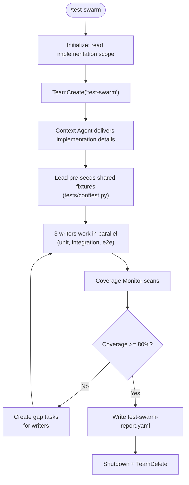

# Test Swarm

Parallel test writing by domain using an Agent Team. Each writer owns a testing domain (unit, integration, e2e) and works simultaneously. A coverage monitor identifies gaps and dynamically creates tasks for the writers.

**Lifecycle context:** `docs/SPRINT_LIFECYCLE.md` Phase 6.5 (optional) | **Patterns:** `skills/team-patterns/SKILL.md` | **Methodology:** `skills/testing-strategy/SKILL.md`

## Usage

```text
/test-swarm                      # Test current implementation
/test-swarm sprint               # Integrated: test sprint's implementation (Phase 6.5)
/test-swarm <module-path>        # Test specific module
```

## Flow



## Instructions

### 0. Initialize

1. Parse `$ARGUMENTS`:
   - No args → scope from uncommitted changes
   - `sprint` → read `.sprint/execution-status.yaml` for implemented tasks/files
   - `<path>` → test specific module
2. Run initial `pytest --cov --cov-report=json -q` to establish baseline coverage
3. Create team working state

### 1. Context and Strategy Selection

1. Spawn Context Agent → gathers implementation details, existing test patterns, standards
2. Apply `skills/testing-strategy/SKILL.md` decision table per module:
   - Pure domain logic → Chicago TDD + property-based
   - Adapters/boundaries → London TDD
   - Serialization/parsing → roundtrip tests
   - Authorization/financial → mutation testing audit

### 2. Create Team and Spawn

```
TeamCreate: "test-swarm"
```

| Teammate | Name | Base Agent | Model | Tools | Write Boundary |
|----------|------|-----------|-------|-------|---------------|
| Context Agent | `ctx` | `agents/context-agent.md` | opus | Read, Grep, Glob, Task | (none) |
| Unit Writer | `unit-wr` | `agents/tdd-guide.md` | opus | Read, Write, Edit, Bash, Grep | `tests/unit/**` |
| Integration Writer | `intg-wr` | `agents/tdd-guide.md` | opus | Read, Write, Edit, Bash, Grep | `tests/integration/**` |
| E2E Writer | `e2e-wr` | `agents/e2e-runner.md` | haiku | Read, Write, Edit, Bash, Grep, Glob | `tests/e2e/**`, `tests/pages/**` |
| Coverage Monitor | `cov-mon` | (new role) | haiku | Read, Bash, Grep, Glob | (none — read-only) |

### 3. Pre-Seed Shared Fixtures

Before writers start, the lead reads existing `tests/conftest.py` and implementation code, then creates/updates shared fixtures (app factory, db session, test client, auth helpers).

**Lead owns `tests/conftest.py`** — serialized access via fixture request protocol.

### 4. Create Initial Tasks

For each implemented module/task from scope analysis:

```
UNIT-{N}: "Write unit tests for {module}"
  owner: unit-wr
  blockedBy: [context-task]

INTG-{N}: "Write integration tests for {endpoint/service}"
  owner: intg-wr
  blockedBy: [context-task]

E2E-{N}: "Write E2E test for {user flow}"
  owner: e2e-wr
  blockedBy: [context-task]
```

### 5. Fixture Coordination Protocol

When a writer needs a shared fixture not in `tests/conftest.py`:

1. Writer sends `FIXTURE_REQUEST` to lead:
   ```
   FIXTURE_REQUEST
   Name: test_user
   Returns: User instance with email="test@example.com"
   Scope: function
   Dependencies: db_session
   ```
2. Lead creates/updates `tests/conftest.py`
3. Lead broadcasts: "Shared fixture `test_user` added to `tests/conftest.py`"

Domain-specific conftest files are owned by their writer:
- `tests/unit/conftest.py` → unit-wr
- `tests/integration/conftest.py` → intg-wr
- `tests/e2e/conftest.py` → e2e-wr

### 6. Writer Communication

Writers message each other for coordination:
- Mock patterns: "I'm mocking Redis like X — use same approach for consistency"
- Test data: "Using user_id=42 for test fixtures — avoid collision"
- Shared constants: "Created TEST_API_KEY in unit/conftest.py"

### 7. Coverage Monitor Feedback Loop

After all initial tasks complete, lead messages `cov-mon`: "Begin monitoring."

Coverage Monitor loop (max 3 cycles):
1. Run `pytest --cov --cov-report=json -q`
2. Parse coverage JSON: per-file percentages, uncovered line ranges
3. Classify gaps by test domain (using `testing-strategy` decision table):
   - Uncovered functions/classes → unit-wr
   - Uncovered endpoints/service interactions → intg-wr
   - Uncovered user flows → e2e-wr
4. `TaskCreate` per gap, assigned to appropriate writer
5. Message lead: "Coverage scan #{N}: {overall}% — created {count} gap tasks"
6. Wait for gap tasks to complete, then re-scan
7. Exit when coverage >= 80% OR max 3 cycles exhausted

### 8. Completion

1. Lead runs final `pytest --cov --cov-report=term-missing`
2. Write `.sprint/test-swarm-report.yaml` (see template)
3. `SendMessage(type: shutdown_request)` to each teammate
4. `TeamDelete`

## Sprint Integration

### Phase 6.5 Activation Criteria (in orchestrate.md)

Invoke `/test-swarm sprint` after Phase 6 when:
- Sprint backlog has 5+ tasks (major feature)
- Sprint involves 3+ modules (cross-cutting)
- Coverage after Phase 6 is below 70%
- Developer explicitly requests it

### Downstream Integration
- `.sprint/test-swarm-report.yaml` consumed by Phase 8 (QA Validation)
- Coverage data supplements `.sprint/qa-report.yaml`

## File Ownership

| Writer | Exclusive Files |
|--------|----------------|
| ctx | (none) |
| unit-wr | `tests/unit/**`, `tests/unit/conftest.py` |
| intg-wr | `tests/integration/**`, `tests/integration/conftest.py` |
| e2e-wr | `tests/e2e/**`, `tests/e2e/conftest.py`, `tests/pages/**` |
| cov-mon | (none — read-only) |
| lead | `tests/conftest.py`, `.sprint/test-swarm-report.yaml` |

## Arguments

```
$ARGUMENTS:
  (none)         → Test uncommitted changes
  sprint         → Test sprint implementation (Phase 6.5)
  <path>         → Test specific module
```

## Composition

**Invokes (as teammates):** `agents/context-agent.md`, `agents/tdd-guide.md` (x2), `agents/e2e-runner.md`, coverage monitor (ad-hoc)
**Reads:** `.sprint/execution-status.yaml`, `.sprint/backlog.yaml`, `skills/testing-strategy/SKILL.md`
**Writes:** test files in `tests/`, `.sprint/test-swarm-report.yaml`
**Used by:** `commands/orchestrate.md` (optional Phase 6.5)
